# Battery Optimization System - Class Diagram

**Project**: Battery Storage Economic Analysis System
**Last Updated**: 2025-10-27

---

## Complete UML Class Diagram

```mermaid
classDiagram
    %% Configuration Classes
    class BatteryOptimizationConfig {
        +LocationConfig location
        +SolarSystemConfig solar
        +ConsumptionConfig consumption
        +BatteryConfig battery
        +TariffConfig tariff
        +EconomicConfig economics
        +AnalysisConfig analysis
        +from_yaml(path: str) BatteryOptimizationConfig
        +to_dict() dict
    }

    class LocationConfig {
        +str name
        +float latitude
        +float longitude
    }

    class SolarSystemConfig {
        +float pv_capacity_kwp
        +float inverter_capacity_kw
        +float grid_export_limit_kw
        +float tilt_degrees
        +float azimuth_degrees
        +float system_losses
    }

    class ConsumptionConfig {
        +float annual_kwh
        +str profile_type
    }

    class BatteryConfig {
        +Tuple capacity_range_kwh
        +Tuple power_range_kw
        +float efficiency
        +float degradation_rate_yearly
        +int lifetime_years
        +float min_soc
        +float max_soc
    }

    class TariffConfig {
        +float energy_peak
        +float energy_offpeak
        +float energy_tariff
        +List power_brackets
        +Dict consumption_tax_monthly
        +int peak_hour_start
        +int peak_hour_end
    }

    class EconomicConfig {
        +float discount_rate
        +int project_lifetime_years
        +float battery_cost_per_kwh
        +float inverter_cost_per_kw
        +float installation_cost_fixed
    }

    class AnalysisConfig {
        +int start_year
        +int end_year
        +bool use_cache
        +str cache_dir
    }

    BatteryOptimizationConfig *-- LocationConfig
    BatteryOptimizationConfig *-- SolarSystemConfig
    BatteryOptimizationConfig *-- ConsumptionConfig
    BatteryOptimizationConfig *-- BatteryConfig
    BatteryOptimizationConfig *-- TariffConfig
    BatteryOptimizationConfig *-- EconomicConfig
    BatteryOptimizationConfig *-- AnalysisConfig

    %% Data Fetching Classes
    class ENTSOEPriceFetcher {
        +str api_key
        +str bidding_zone
        +float eur_to_nok
        +fetch_day_ahead_prices(start, end) DataFrame
        +fetch_prices(year, use_cache) DataFrame
        -_convert_to_nok(df) DataFrame
        -_validate_data(df) bool
    }

    class PVGISProduction {
        +float latitude
        +float longitude
        +float pv_capacity_kwp
        +float tilt_degrees
        +float azimuth_degrees
        +fetch_hourly_production() DataFrame
        +get_production_data(year, use_cache) DataFrame
        +calculate_annual_production() float
        -_validate_data(df) bool
    }

    class ConsumptionProfile {
        +float annual_kwh
        +str profile_type
        +generate_hourly_profile() DataFrame
        -_base_pattern() ndarray
        -_weekly_pattern() ndarray
        -_seasonal_pattern() ndarray
        -_add_noise() ndarray
    }

    %% Solar System Classes
    class SolarSystem {
        +SolarSystemConfig config
        +DataFrame production_data
        +calculate_production() DataFrame
        +calculate_curtailment() DataFrame
        +apply_inverter_clipping() DataFrame
        +apply_shading_losses() DataFrame
        +get_usable_production() DataFrame
        +get_curtailed_energy() float
    }

    SolarSystem --> SolarSystemConfig
    SolarSystem --> PVGISProduction

    %% Battery Classes
    class Battery {
        +float capacity_kwh
        +float power_kw
        +float efficiency
        +float soc
        +float soh
        +float degradation_rate
        +charge(power, hours) float
        +discharge(power, hours) float
        +get_state() dict
        +step(hours) None
        +apply_degradation(years) None
        +reset() None
    }

    class BatteryModel {
        +BatterySpec spec
        +LpProblem model
        +Dict variables
        +create_variables(horizon) None
        +add_constraints() None
        +calculate_operating_cost() float
        +get_solution() dict
    }

    class BatterySpec {
        +float capacity_kwh
        +float power_kw
        +float efficiency
        +float min_soc
        +float max_soc
        +float degradation_cost_per_kwh
    }

    BatteryModel --> BatterySpec

    %% Optimization Classes
    class BatteryOptimizer {
        +SolarSystem solar_system
        +Battery battery
        +DataFrame prices
        +DataFrame consumption
        +TariffConfig tariff
        +optimize() OptimizationResult
        -_objective_function(x) float
        -_simulate_year(capacity, power) dict
        -_calculate_revenue(battery_schedule) float
        -_sensitivity_analysis() DataFrame
    }

    class MILPBatteryOptimizer {
        +BatteryModel battery_model
        +DataFrame prices
        +DataFrame solar
        +DataFrame consumption
        +TariffConfig tariff
        +str solver
        +optimize_operation() MILPResult
        -_build_model() LpProblem
        -_add_objectives() None
        -_solve() int
        -_extract_results() dict
    }

    class OptimizationResult {
        +float optimal_capacity_kwh
        +float optimal_power_kw
        +float npv
        +float irr
        +float payback_years
        +dict annual_revenue
        +DataFrame battery_schedule
        +dict sensitivity_results
    }

    class MILPResult {
        +DataFrame battery_schedule
        +DataFrame grid_flows
        +float total_revenue
        +float total_cost
        +dict monthly_peaks
        +str solver_status
        +float solve_time
    }

    BatteryOptimizer --> Battery
    BatteryOptimizer --> SolarSystem
    BatteryOptimizer --> TariffConfig
    BatteryOptimizer ..> OptimizationResult

    MILPBatteryOptimizer --> BatteryModel
    MILPBatteryOptimizer --> TariffConfig
    MILPBatteryOptimizer ..> MILPResult

    %% Real Optimization (Integration)
    class BatteryOptimizerReal {
        +BatteryOptimizationConfig config
        +MILPBatteryOptimizer milp_optimizer
        +EconomicModel economic_model
        +optimize_battery_size() OptimizationResult
        +optimize_operation(capacity, power) MILPResult
        +calculate_economics(result) EconomicResults
        +sensitivity_analysis(param_ranges) DataFrame
    }

    BatteryOptimizerReal --> MILPBatteryOptimizer
    BatteryOptimizerReal --> EconomicModel
    BatteryOptimizerReal --> BatteryOptimizationConfig

    %% Economic Classes
    class EconomicModel {
        +EconomicConfig config
        +TariffConfig tariff
        +calculate_annual_revenue(schedule) float
        +calculate_annual_costs(capacity, power) float
        +calculate_npv(cashflows) float
        +calculate_irr(cashflows) float
        +calculate_payback(cashflows) float
        +sensitivity_analysis(params) DataFrame
    }

    class EconomicResults {
        +float npv
        +float irr
        +float payback_years
        +List annual_cashflows
        +dict revenue_breakdown
        +dict cost_breakdown
    }

    class EconomicAnalyzer {
        +analyze_battery_economics(result) EconomicResults
        +calculate_npv(cashflows, rate) float
        +calculate_irr(cashflows) float
        +calculate_payback_period(cashflows) float
        +find_break_even_cost(result) float
    }

    EconomicModel --> EconomicConfig
    EconomicModel --> TariffConfig
    EconomicModel ..> EconomicResults
    EconomicAnalyzer ..> EconomicResults

    %% Value Drivers (Functions)
    class ValueDrivers {
        <<module>>
        +calculate_curtailment_value(solar, battery) float
        +calculate_arbitrage_value(prices, battery) float
        +calculate_demand_charge_savings(peaks, tariff) float
        +calculate_self_consumption_value(consumption, solar) float
        +calculate_all_value_drivers(data) dict
    }

    ValueDrivers --> TariffConfig

    %% Result Presentation
    class ResultPresenter {
        +OptimizationResult result
        +BatteryOptimizationConfig config
        +create_report(format) str
        +plot_monthly_production() Figure
        +plot_daily_profile() Figure
        +plot_duration_curve() Figure
        +plot_power_tariff() Figure
        +plot_economics() Figure
        +export_to_html(path) None
        +export_to_json(path) None
    }

    class BatteryAnalysisResults {
        +OptimizationResult optimization
        +EconomicResults economics
        +dict sensitivity
        +List figures
        +to_dict() dict
        +to_json() str
    }

    ResultPresenter --> OptimizationResult
    ResultPresenter --> BatteryOptimizationConfig
    BatteryAnalysisResults *-- OptimizationResult
    BatteryAnalysisResults *-- EconomicResults

    %% Main Entry Points
    class Main {
        <<module>>
        +run_simulation(config) BatteryAnalysisResults
        +run_optimization(config) OptimizationResult
        +run_analysis(result) EconomicResults
        +generate_report(results) None
        +main() None
    }

    Main --> BatteryOptimizationConfig
    Main --> BatteryOptimizerReal
    Main --> ResultPresenter
    Main ..> BatteryAnalysisResults
```



---

## Detailed Class Descriptions

### 1. Configuration Layer

#### `BatteryOptimizationConfig`
**Purpose**: Master configuration container that aggregates all system configuration
**Responsibilities**:
- Load configuration from YAML file
- Provide type-safe access to all config parameters
- Validate configuration values

**Key Relationships**:
- Aggregates 7 specialized config dataclasses
- Used by all major system components

#### `LocationConfig`, `SolarSystemConfig`, `ConsumptionConfig`, etc.
**Purpose**: Specialized configuration dataclasses for specific domains
**Pattern**: Data Transfer Objects (DTOs) with validation
**Benefits**: Type safety, immutability, clear separation of concerns

---

### 2. Data Fetching Layer

#### `ENTSOEPriceFetcher`
**Purpose**: Fetch electricity spot prices from ENTSO-E API
**Responsibilities**:
- API communication with ENTSO-E Transparency Platform
- Currency conversion (EUR → NOK)
- Data validation and caching
- Handle rate limiting and errors

**Key Methods**:
- `fetch_prices(year, use_cache)`: Main entry point
- `_convert_to_nok(df)`: Currency conversion
- `_validate_data(df)`: Quality checks

**Dependencies**:
- External: ENTSO-E API (requires API key)
- Internal: Cache system in `data/spot_prices/`

#### `PVGISProduction`
**Purpose**: Fetch solar production data from PVGIS API
**Responsibilities**:
- API communication with PVGIS service
- TMY (Typical Meteorological Year) data retrieval
- Production data validation and caching
- Annual production calculations

**Key Methods**:
- `get_production_data(year, use_cache)`: Main entry point
- `calculate_annual_production()`: Sum yearly output
- `_validate_data(df)`: Quality checks

**Dependencies**:
- External: PVGIS API (no auth required)
- Internal: Cache system in `data/pv_profiles/`

#### `ConsumptionProfile`
**Purpose**: Generate realistic consumption profiles for commercial buildings
**Responsibilities**:
- Create hourly load profiles based on patterns
- Apply diurnal, weekly, and seasonal variations
- Add realistic noise and variability

**Key Methods**:
- `generate_hourly_profile()`: Main generation function
- `_base_pattern()`: Diurnal cycle (low at night, high during day)
- `_weekly_pattern()`: Weekday vs weekend differences
- `_seasonal_pattern()`: Summer vs winter variations
- `_add_noise()`: Random variability

**Pattern**: Builder pattern with composable patterns

---

### 3. Solar System Layer

#### `SolarSystem`
**Purpose**: Model complete PV system with all losses and limits
**Responsibilities**:
- Apply inverter clipping (110 kW limit)
- Calculate curtailment (77 kW grid export limit)
- Apply system losses (shading, soiling, etc.)
- Calculate usable vs lost production

**Key Methods**:
- `calculate_production()`: Full production with all losses
- `calculate_curtailment()`: Energy lost to export limit
- `apply_inverter_clipping()`: Inverter capacity limit
- `get_usable_production()`: Net available energy

**Dependencies**:
- Uses `PVGISProduction` for raw production data
- Configured by `SolarSystemConfig`

**Design Pattern**: Facade pattern (simplifies complex calculations)

---

### 4. Battery Layer

#### `Battery`
**Purpose**: Simulate physical battery behavior over time
**Responsibilities**:
- Track state of charge (SoC) and state of health (SoH)
- Apply charge/discharge efficiency losses
- Model degradation over lifetime
- Enforce physical constraints (power limits, SoC limits)

**Key Methods**:
- `charge(power, hours)`: Charge operation
- `discharge(power, hours)`: Discharge operation
- `get_state()`: Current SoC, capacity, health
- `apply_degradation(years)`: Aging model
- `reset()`: Reset to initial state

**State Variables**:
- `soc`: State of Charge (0-1)
- `soh`: State of Health (1.0 = new, decreases with age)
- `capacity_kwh`: Current capacity (degrades over time)

**Design Pattern**: State pattern with time-stepping simulation

#### `BatteryModel` (MILP)
**Purpose**: Mathematical model of battery for linear programming
**Responsibilities**:
- Create LP decision variables (charge, discharge, SoC)
- Add physical and operational constraints
- Calculate operating costs (degradation)
- Extract solution from solver

**Key Methods**:
- `create_variables(horizon)`: Create LP variables for all timesteps
- `add_constraints()`: Physics and operational limits
- `get_solution()`: Parse solver results

**Variables Created**:
```python
charge[t] ∈ [0, power_kw]        # Charge power at hour t
discharge[t] ∈ [0, power_kw]     # Discharge power at hour t
soc[t] ∈ [min_soc, max_soc]      # State of charge at hour t
```

**Design Pattern**: Builder pattern (constructs complex LP model)

#### `BatterySpec`
**Purpose**: Battery specification data object
**Responsibilities**: Encapsulate battery technical specifications
**Pattern**: Value Object (immutable data holder)

---

### 5. Optimization Layer

#### `BatteryOptimizer` (Differential Evolution)
**Purpose**: Find optimal battery size using metaheuristic optimization
**Responsibilities**:
- Search for optimal capacity (kWh) and power (kW)
- Simulate year-long operation for each candidate
- Calculate NPV for each candidate
- Run sensitivity analysis

**Algorithm**: Differential Evolution
- Population-based global optimization
- Handles non-convex, multimodal functions
- No gradient information required

**Key Methods**:
- `optimize()`: Main optimization loop
- `_objective_function(x)`: NPV calculation for candidate [capacity, power]
- `_simulate_year()`: Hourly simulation over full year
- `_calculate_revenue()`: Sum all revenue streams

**Search Space**:
```python
capacity_kwh: [20, 200]  # kWh
power_kw: [10, 100]      # kW
```

**Returns**: `OptimizationResult` with optimal sizing and economics

**Design Pattern**: Strategy pattern (pluggable optimization algorithms)

#### `MILPBatteryOptimizer`
**Purpose**: Optimize battery dispatch schedule using linear programming
**Responsibilities**:
- Build LP model of battery operation
- Define revenue maximization objective
- Add all constraints (battery, grid, tariff)
- Solve using external LP solver (HiGHS, CBC)
- Extract optimal schedule

**Key Methods**:
- `optimize_operation()`: Main entry point
- `_build_model()`: Construct LP problem
- `_add_objectives()`: Revenue maximization function
- `_solve()`: Call external solver
- `_extract_results()`: Parse solution

**Objective Function**:
```python
maximize: Σ_t (
    arbitrage_revenue[t] +
    curtailment_value[t] +
    peak_shaving_value[t] +
    self_consumption_value[t]
    - degradation_cost[t]
)
```

**Constraints**:
- Battery physics (SoC dynamics)
- Power limits (charge/discharge)
- Grid export limit (77 kW)
- Mutual exclusion (can't charge and discharge simultaneously)

**Returns**: `MILPResult` with optimal hourly schedule

**Design Pattern**: Facade pattern (hides LP complexity)

#### `BatteryOptimizerReal` (Integration)
**Purpose**: High-level optimizer combining sizing and dispatch
**Responsibilities**:
- Coordinate MILP optimizer for dispatch
- Use differential evolution for sizing
- Calculate full economics via EconomicModel
- Run multi-parameter sensitivity analysis

**Key Methods**:
- `optimize_battery_size()`: Full optimization pipeline
- `optimize_operation(capacity, power)`: Dispatch for given size
- `calculate_economics(result)`: NPV/IRR/payback
- `sensitivity_analysis(ranges)`: Parameter sweeps

**Workflow**:
```
1. For each candidate battery size:
   a. Run MILP optimizer for optimal dispatch
   b. Calculate annual revenue from schedule
   c. Calculate NPV
2. Return size with highest NPV
3. Run sensitivity analysis around optimal point
```

**Design Pattern**: Facade + Template Method

---

### 6. Economic Analysis Layer

#### `EconomicModel`
**Purpose**: Calculate all economic metrics for battery investment
**Responsibilities**:
- Calculate annual revenues (4 streams)
- Calculate annual costs (CAPEX + O&M)
- Calculate NPV (Net Present Value)
- Calculate IRR (Internal Rate of Return)
- Calculate payback period
- Run economic sensitivity analysis

**Key Methods**:
- `calculate_annual_revenue(schedule)`: Sum all revenue streams
- `calculate_annual_costs(capacity, power)`: CAPEX + O&M
- `calculate_npv(cashflows)`: Discount to present value
- `calculate_irr(cashflows)`: Solve for IRR
- `calculate_payback(cashflows)`: Years to recover CAPEX

**Revenue Streams**:
1. **Curtailment value**: Avoided solar curtailment
2. **Arbitrage**: Buy low (night), sell high (day)
3. **Demand charge savings**: Reduce monthly peak power
4. **Self-consumption**: Avoid grid tariffs

**Cost Components**:
- CAPEX: `capacity × cost_per_kwh + power × cost_per_kw + fixed_cost`
- O&M: Annual maintenance and replacement reserves
- Degradation: Gradual capacity loss over lifetime

**Economic Formulas**:
```python
NPV = -CAPEX + Σ(cashflow[year] / (1 + discount_rate)^year)
IRR: solve for r where NPV(r) = 0
Payback: first year where cumsum(cashflows) > CAPEX
```

**Design Pattern**: Service layer (encapsulates business logic)

#### `EconomicAnalyzer`
**Purpose**: Higher-level economic analysis and reporting
**Responsibilities**:
- Wrap EconomicModel for easier use
- Find break-even battery costs
- Generate economic reports
- Compare scenarios

**Key Methods**:
- `analyze_battery_economics(result)`: Full analysis
- `find_break_even_cost(result)`: NPV = 0 → cost per kWh
- Reuses `calculate_npv`, `calculate_irr`, etc.

**Design Pattern**: Facade (simplified interface to EconomicModel)

#### `EconomicResults`
**Purpose**: Economic analysis results data container
**Responsibilities**: Store and serialize economic metrics
**Pattern**: Data Transfer Object (DTO)

---

### 7. Value Drivers Module

#### `ValueDrivers` (Module Functions)
**Purpose**: Calculate individual value streams for battery
**Responsibilities**:
- Isolate each revenue source for analysis
- Enable value attribution and sensitivity

**Functions**:
- `calculate_curtailment_value(solar, battery)`:
  - Value: `curtailed_kwh × average_spot_price`
  - When PV > 77 kW grid limit

- `calculate_arbitrage_value(prices, battery)`:
  - Value: `(high_price - low_price) × kwh × efficiency`
  - Buy at night, sell at day

- `calculate_demand_charge_savings(peaks, tariff)`:
  - Value: Difference in Lnett power tariff brackets
  - Progressive: 10 kW = 572 kr/month, 30 kW = 1772 kr/month

- `calculate_self_consumption_value(consumption, solar)`:
  - Value: `increased_self_consumption × grid_tariff`
  - Avoid paying 0.296 kr/kWh grid charge

- `calculate_all_value_drivers(data)`:
  - Aggregate all 4 streams
  - Return breakdown dict

**Design Pattern**: Strategy pattern (pluggable value calculations)

---

### 8. Results & Reporting Layer

#### `ResultPresenter`
**Purpose**: Generate visualizations and reports
**Responsibilities**:
- Create 9 interactive Plotly charts
- Generate HTML and Markdown reports
- Export structured JSON data
- Format results for different audiences

**Key Methods**:
- `create_report(format)`: Full report generation
- `plot_monthly_production()`: Monthly solar bars
- `plot_daily_profile()`: Typical day patterns
- `plot_duration_curve()`: Load duration curves
- `plot_power_tariff()`: Tariff bracket visualization
- `plot_economics()`: NPV/IRR/payback charts
- `export_to_html(path)`: Interactive HTML report
- `export_to_json(path)`: Machine-readable results

**Figures Generated**:
1. Monthly production (solar vs consumption)
2. Daily profile (typical weekday)
3. Duration curve (sorted power levels)
4. Power tariff brackets (cost by peak kW)
5. May analysis (curtailment example month)
6. June 15 (single day detail)
7. Battery operation (charge/discharge schedule)
8. Cash flow (NPV over project lifetime)
9. Value drivers (revenue breakdown pie chart)

**Design Pattern**: Builder + Template Method

#### `BatteryAnalysisResults`
**Purpose**: Complete analysis results container
**Responsibilities**:
- Aggregate optimization + economics + sensitivity
- Provide serialization methods
- Store generated figures

**Design Pattern**: Composite (aggregates multiple result types)

---

### 9. Main Entry Point

#### `Main` (Module)
**Purpose**: Orchestrate complete analysis workflow
**Responsibilities**:
- Load configuration
- Run optimization
- Calculate economics
- Generate reports
- Handle errors and logging

**Functions**:
- `run_simulation(config)`: Full pipeline
  ```
  1. Load/fetch data (prices, solar, consumption)
  2. Run optimization (find optimal battery)
  3. Calculate economics (NPV, IRR, payback)
  4. Generate visualizations
  5. Create reports
  ```

- `run_optimization(config)`: Optimization only
- `run_analysis(result)`: Post-optimization analysis
- `generate_report(results)`: Reporting only
- `main()`: CLI entry point

**Design Pattern**: Facade + Workflow orchestration

---

## Class Relationships Summary

### Inheritance
**None** - This project uses composition over inheritance
- All classes are concrete (no abstract base classes except ABC in archived code)
- Polymorphism achieved through duck typing (Python convention)

### Composition (Has-A)
- `BatteryOptimizationConfig` **contains** 7 config dataclasses
- `BatteryOptimizerReal` **contains** `MILPBatteryOptimizer` + `EconomicModel`
- `BatteryAnalysisResults` **contains** `OptimizationResult` + `EconomicResults`

### Association (Uses-A)
- `BatteryOptimizer` **uses** `Battery`, `SolarSystem`, `TariffConfig`
- `MILPBatteryOptimizer` **uses** `BatteryModel`, `TariffConfig`
- `EconomicModel` **uses** `EconomicConfig`, `TariffConfig`
- `ResultPresenter` **uses** `OptimizationResult`, `BatteryOptimizationConfig`
- `Main` **uses** everything (orchestration layer)

### Dependency (Depends-On)
- `SolarSystem` **depends on** `PVGISProduction` for data
- `BatteryOptimizer` **depends on** `ENTSOEPriceFetcher` for prices
- `ValueDrivers` **depends on** `TariffConfig` for tariff calculations

---

## Design Patterns Used

### Creational Patterns
- **Factory Method**: `BatteryOptimizationConfig.from_yaml()` creates config from file
- **Builder**: `BatteryModel` builds complex LP models incrementally

### Structural Patterns
- **Facade**:
  - `BatteryOptimizerReal` simplifies complex optimization pipeline
  - `Main` module provides simple interface to entire system
- **Composite**: `BatteryAnalysisResults` aggregates multiple result types
- **Adapter**: Config classes adapt YAML data to Python dataclasses

### Behavioral Patterns
- **Strategy**:
  - Multiple optimizer implementations (DE, MILP)
  - Multiple value driver calculations (pluggable)
- **Template Method**:
  - `Main.run_simulation()` defines workflow skeleton
  - Steps can be customized via config
- **Observer**: Implicit via result callbacks and reporting

---

## Data Flow Between Classes

```
Config (YAML)
  ↓ from_yaml()
BatteryOptimizationConfig
  ↓
┌─────────────────┴─────────────────┐
↓                                   ↓
ENTSOEPriceFetcher          PVGISProduction
↓ fetch_prices()            ↓ get_production_data()
DataFrame (prices)          DataFrame (solar)
  ↓                                   ↓
  └──────────────┬────────────────────┘
                 ↓
         BatteryOptimizerReal
                 ↓ optimize_battery_size()
         MILPBatteryOptimizer
                 ↓ optimize_operation()
            MILPResult (schedule)
                 ↓
           EconomicModel
                 ↓ calculate_economics()
          EconomicResults (NPV, IRR, payback)
                 ↓
          ResultPresenter
                 ↓ create_report()
      HTML Report + Visualizations
```

---

## Key Interfaces (Duck Typing)

Python doesn't have explicit interfaces, but these are the implicit contracts:

### Optimizer Interface
```python
class Optimizer:
    def optimize() -> OptimizationResult:
        """Find optimal battery configuration"""
        pass
```
**Implementers**: `BatteryOptimizer` (DE), `BatteryOptimizerReal` (MILP)

### DataFetcher Interface
```python
class DataFetcher:
    def fetch_data(year: int, use_cache: bool) -> DataFrame:
        """Fetch time series data"""
        pass

    def _validate_data(df: DataFrame) -> bool:
        """Validate data quality"""
        pass
```
**Implementers**: `ENTSOEPriceFetcher`, `PVGISProduction`

### ResultContainer Interface
```python
class ResultContainer:
    def to_dict() -> dict:
        """Serialize to dictionary"""
        pass

    def to_json() -> str:
        """Serialize to JSON"""
        pass
```
**Implementers**: All result classes (`OptimizationResult`, `EconomicResults`, etc.)

---

## Testing Architecture

### Unit Test Classes (Planned)

```mermaid
classDiagram
    class TestENTSOEPriceFetcher {
        +test_fetch_prices_structure()
        +test_fetch_prices_quality()
        +test_currency_conversion()
        +test_caching()
        +test_api_errors()
    }

    class TestPVGISProduction {
        +test_fetch_production_structure()
        +test_annual_production()
        +test_monthly_distribution()
        +test_caching()
        +test_api_errors()
    }

    class TestBattery {
        +test_charge_discharge()
        +test_efficiency_losses()
        +test_degradation()
        +test_soc_limits()
        +test_power_limits()
    }

    class TestBatteryModel {
        +test_variable_creation()
        +test_constraint_addition()
        +test_solution_extraction()
    }

    class TestMILPOptimizer {
        +test_optimize_operation()
        +test_solver_selection()
        +test_constraint_satisfaction()
        +test_objective_calculation()
    }

    class TestEconomicModel {
        +test_npv_calculation()
        +test_irr_calculation()
        +test_payback_calculation()
        +test_revenue_streams()
        +test_cost_components()
    }

    class TestIntegration {
        +test_full_pipeline()
        +test_config_loading()
        +test_data_flow()
        +test_result_generation()
    }
```



**Current Status**:
- ✅ `TestENTSOEPriceFetcher`: 16/16 tests passing
- ✅ `TestPVGISProduction`: 19/19 tests passing
- ⏳ Others: Not yet implemented

---

## Extension Points

### Adding New Optimizers
1. Create new class implementing optimizer interface
2. Add `optimize()` method returning `OptimizationResult`
3. Register in `Main.run_optimization()`

### Adding New Revenue Streams
1. Add function to `ValueDrivers` module
2. Update `EconomicModel.calculate_annual_revenue()`
3. Update `ResultPresenter` for new visualization

### Adding New Data Sources
1. Create new fetcher class (like `ENTSOEPriceFetcher`)
2. Implement `fetch_data()` and `_validate_data()` methods
3. Add to `Main.run_simulation()` data loading

### Adding New Economic Metrics
1. Add method to `EconomicModel`
2. Update `EconomicResults` dataclass
3. Update `ResultPresenter` for display

---

**Last Updated**: 2025-10-27
**Diagram Tool**: Mermaid (supports GitHub, VSCode, etc.)
**Render**: Copy mermaid blocks to mermaid.live or GitHub markdown
