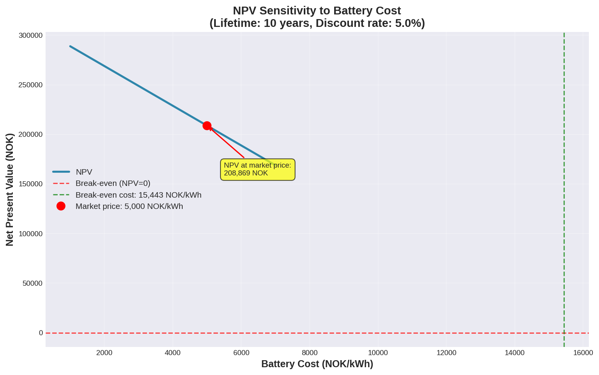
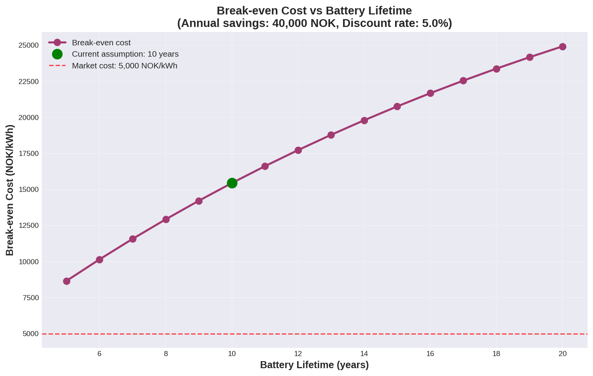
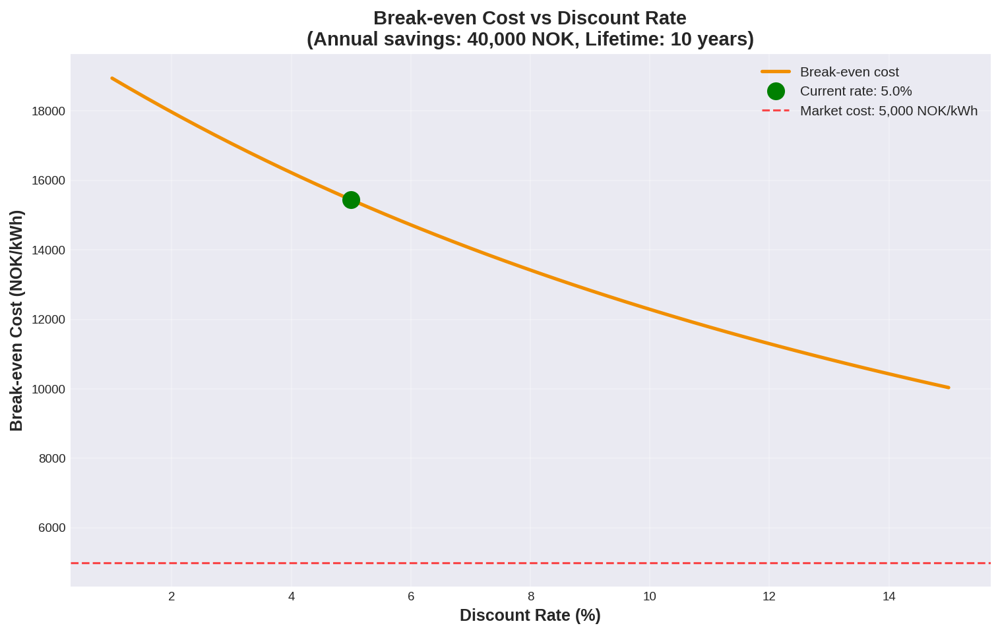

# Break-Even Battery Cost Analysis

**Generated:** 2025-10-30 09:23:25

## Analyzed Scenarios

- **reference**
  - Battery: N/A kWh, N/A kW
  - Strategy: NoControl
  - Total Cost: 425000 NOK/year
- **simplerule_20kwh**
  - Battery: 20.0 kWh, 10.0 kW
  - Strategy: SimpleRule
  - Total Cost: 385000 NOK/year

## Key Findings

- Annual savings from battery: **40,000 NOK**
- Break-even battery cost: **15,443 NOK/kWh**
- Market price: **5,000 NOK/kWh**
- Investment viability: **✓ Viable**

## Generated Visualizations

### Npv Sensitivity

### Breakeven Vs Lifetime

### Breakeven Vs Discount Rate

